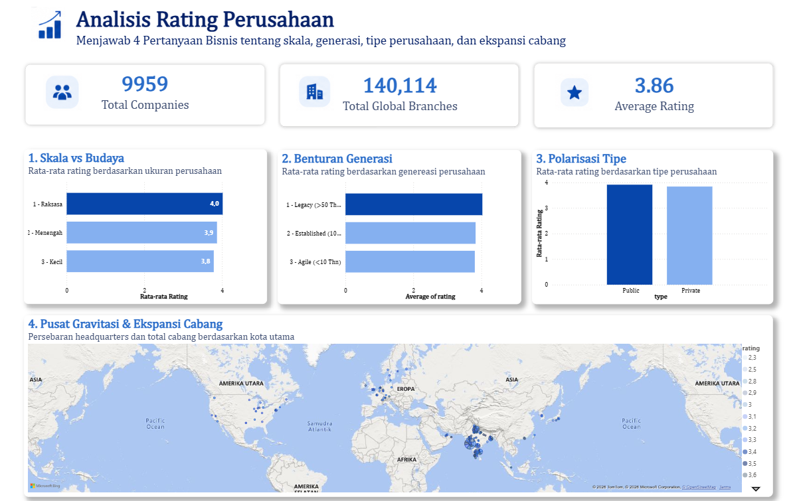

# The Hidden Cost of Over-Expansion: Debunking Startup Culture Myths


> **View the visual summary on my [Portfolio Website ↗]([MASUKKAN_LINK_WEBSITE_PORTOPOLIO_KAMU_DISINI])**
> 
## 📌 Business Problem
Many executives and HR teams make strategic decisions based on untested corporate myths: assuming startup culture is inherently healthier than legacy companies, that huge company size kills employee satisfaction, or that aggressive branch expansion proves success. 
Making decisions purely on these assumptions risks triggering turnover spikes. This project aims to analyze employee sentiment data from 9,900+ global companies on AmbitionBox to separate workplace myths from empirical reality.

## 🗂️ Data Architecture & Pipeline
The original dataset was scraped from the web and contained severe structural anomalies. I built a 3-tier pipeline to process it:
```text
[AmbitionBox Raw Data]
      │
      ▼
[Python / Pandas] → Keyword-Based Extraction, resolving Dynamic Column Shifting
      │
      ▼
[PostgreSQL] → Relational table creation and business logic aggregation
      │
      ▼
[Power BI] → F-Pattern Dashboard Design, DAX Auto-Formatting Bypass
```

## 💻 Featured Code: Solving Dynamic Column Shifting
The Challenge: Web-scraped location text (e.g., "Slovak Republic + 5 more") overflowed into adjacent cells, causing a domino effect where numeric columns (age, employees) shifted unpredictably. Standard Pandas shift() functions failed due to the irregularity. The Solution: I built a custom extraction logic using Pandas string manipulation and Regex to pull data back based on keywords rather than column index positions.
```python
# Example logic: Extracting values based on identifying keywords rather than static columns
# Cleaning noise text and converting to strict Int64 for SQL ingestion
df['old'] = df['old'].astype(str).str.replace('years old', '', regex=True).str.strip()
df['employees'] = df['employees'].astype(str).str.replace(r'\+? employees', '', regex=True).str.strip()
# Categorizing company generations for downstream SQL analysis
def categorize_age(years):
    if pd.isna(years): return 'Unknown'
    if years > 50: return 'Legacy'
    if years >= 10: return 'Established'
    return 'Agile/Startup'
df['company_generation'] = pd.to_numeric(df['old'], errors='coerce').apply(categorize_age)
```

## 📊 Key Insights & Dashboard
The interactive dashboard was built to maintain executive-level numeric precision. I bypassed Power BI's default DAX auto-formatting to prevent rounding (e.g., preventing 9,959 from rounding to "10K").



Key Findings
1. The "Scale vs Culture" Paradox: Giants Win Giant companies (>6,000 employees) lead employee satisfaction with a 4.02 rating. Meanwhile, small companies (3,097 of them—the largest segment) score the lowest at 3.75. The assumption that massive companies suffer from rigid bureaucracy that drives people away is empirically false in this dataset.
2. Startups Struggle with Satisfaction When categorized by generation, Legacy companies (>50 years old) lead with a 4.03 rating, while Startups (<10 years old) sit at the bottom with 3.71. The "fun startup culture" myth does not translate to broader employee satisfaction.
3. Hyper-Expansion Depresses Culture Analyzing location data revealed that Mumbai-based companies pursued hyper-expansion (mapping 34,590+ branches), yet their overall employee satisfaction was noticeably depressed compared to companies based in Chennai, which exhibited controlled, stable growth.

## 💡 Strategic Recommendations & Business Impact
* Rethink Startup Envy: Established corporations should stop trying to mimic "startup culture" (which empirically yields lower satisfaction) and instead double down on the stability, structured growth, and legacy benefits that actually drive their high employee ratings.
* Prioritize Controlled Expansion: HR and Operations directors must align before opening new branches. Aggressive hyper-expansion (as seen in the Mumbai cohort) dilutes company culture and strains employee satisfaction. Growth must be sustainable.
* Scale is an Asset, Not a Liability: HR teams in giant organizations (>6,000 employees) should leverage their size as a recruiting tool. The data proves that large-scale infrastructure provides a better employee experience than small-scale agility.

## 📂 Repository Structure
```text
├── Data/
│   ├── ambitionbox.csv              # Raw scraped data (messy)
│   ├── ambitionbox_cleaned_v4.csv   # Final dataset after Python pipeline
│   └── Insight/                     # Aggregated outputs from SQL
├── Notebooks/
│   └── Ambitionbox.ipynb            # Python Pandas data wrangling script
├── Sql/
│   └── Explore.sql                     # PostgreSQL schema and aggregations
├── Images/
│   └── dashboard.png                # Power BI dashboard screenshot
├── Visualization/
│   └── Dashboard.pbix                # Interactive Power BI Desktop file
└── README.md
```

## 🚀 How to View & Replicate
1. View the Dashboard
Open images/dashboard.png directly in this repository, or visit the Portfolio Website for a cleaner visual breakdown.
2. Reproduce the Data Engineering Pipeline
Clone this repository and install python dependencies ```pip install -r requirements.txt``` → Run notebooks/Ambitionbox.ipynb to process the raw .csv and resolve the dynamic column shifting → Import the resulting ambitionbox_cleaned_v4.csv into PostgreSQL using the schema defined in sql/main.sql → Open Visualization/Project6.pbix in Power BI Desktop to interact with the final semantic layer.
